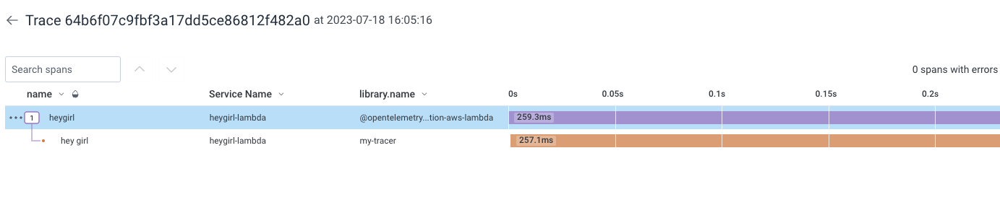

# otel-lambda-node

intended to include auto and manual instrumentation, sent to a collector to send to honeycomb

Following these docs:

- <https://aws-otel.github.io/docs/getting-started/lambda/lambda-js>
- <https://docs.honeycomb.io/integrations/aws/aws-lambda/>

## Add lambda function

- Create zip with contents of project `zip -r heygirl.zip ./`
- Go to lambda, upload function as zip file

## Add environment variables

```sh
AWS_LAMBDA_EXEC_WRAPPER=/opt/otel-handler
HONEYCOMB_API_ENDPOINT=api.honeycomb.io:443
HONEYCOMB_API_KEY=<key>
NODE_OPTIONS=--require ./lambda-config.js
OTEL_EXPORTER_OTLP_ENDPOINT=api.honeycomb.io:443
OTEL_EXPORTER_OTLP_HEADERS=x-honeycomb-team=<key>
OTEL_PROPAGATORS=tracecontext
OTEL_SERVICE_NAME=heygirl-lambda
OTEL_TRACES_SAMPLER=always_on
OTLP_ENDPOINT=api.honeycomb.io:443
```

(not currently using collector config file)

```js
// lambda-config.js
global.configureLambdaInstrumentation = (config) => {
  return {
    ...config,
    disableAwsContextPropagation: true
  }
}
```

```js
// in index.js with other stuff
const opentelemetry = require("@opentelemetry/api");
const tracer = opentelemetry.trace.getTracer("my-tracer");
//
const span = tracer.startSpan("hey girl");
span.end();
```


